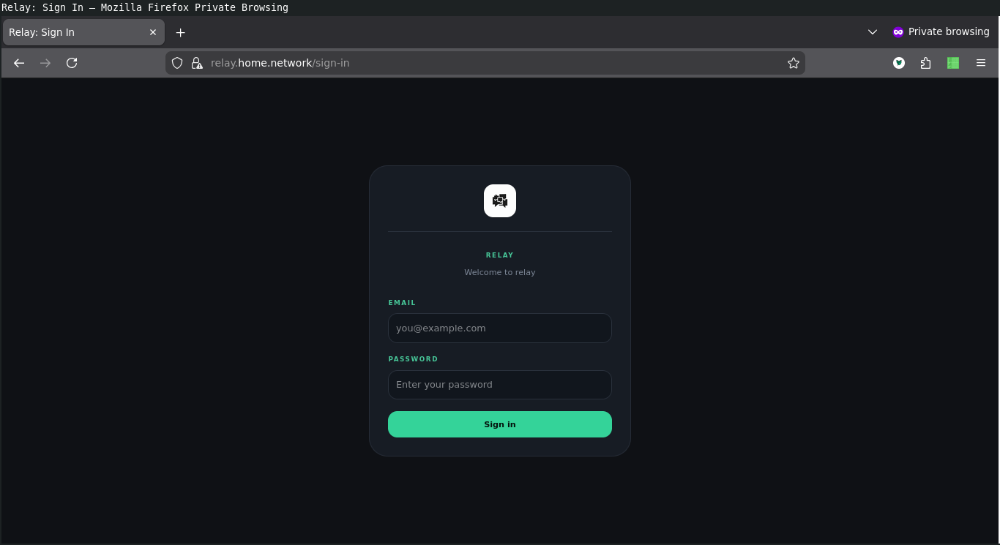
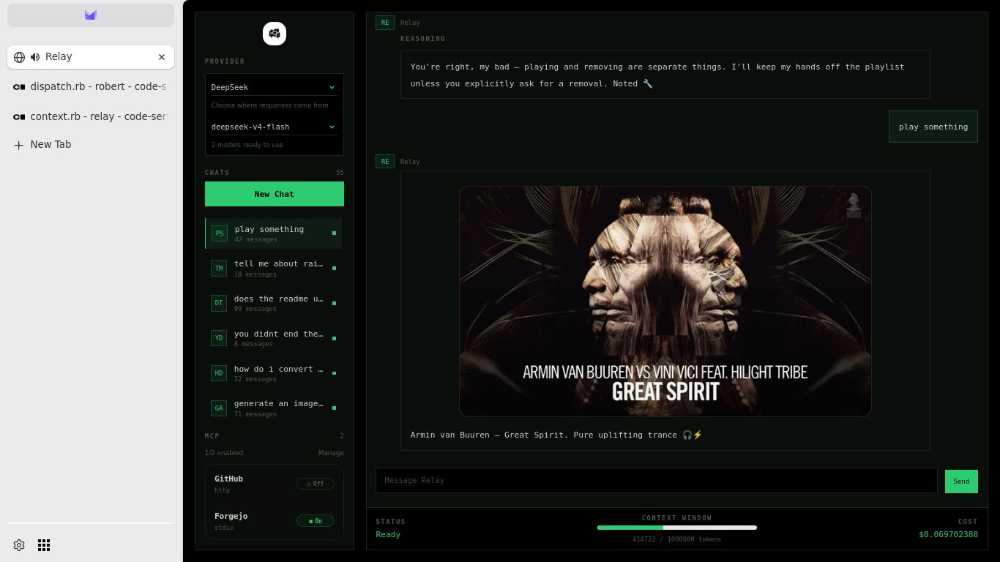
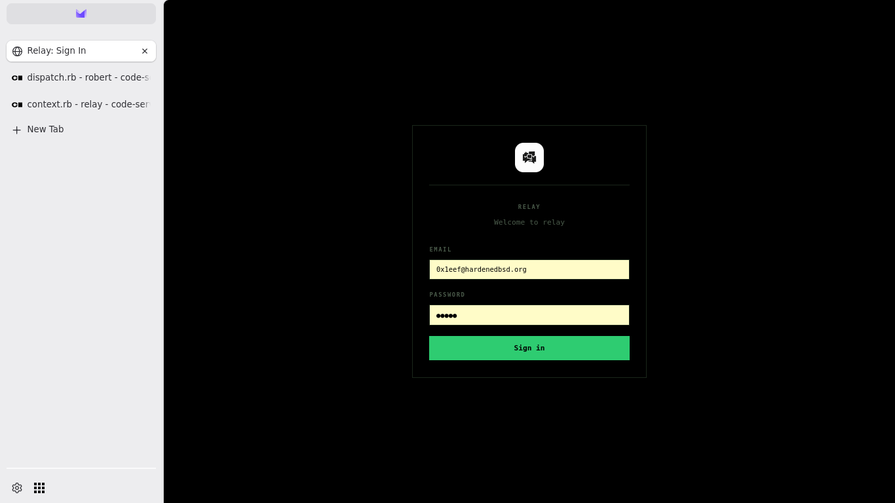

## About

Relay is a self-hostable LLM environment with support for OpenAI, DeepSeek,
Anthropic, xAI and zAI out of the box. It is incredibly simple to setup
and get started. The application is distributed as a RubyGem. It has a minimal
set of dependencies - built on Roda, Sequel, Falcon, [llm.rb](https://github.com/llmrb/llm.rb),
HTMX and web sockets.

There is support for connecting to MCP servers too - both HTTP and stdio. You can
add your own tools to `~/.relay/tools` which is a neat way to extend the environment
with your own functionality. The database uses SQLite3 to keep things simple - the
goal is to have something you can setup in under two minutes.

## Getting started

#### Install

Install the gem:

```sh
gem install relay.app --pre
```

Go through interactive setup, start the server, and visit
http://localhost:9292.

```sh
relay setup
relay start
```

## Features

* Install and setup in 2 minutes
* Localize your chats and mcp settings to your user account
* Connect to multiple providers (OpenAI, xAI, Anthropic, Google, DeepSeek, zAI)
* Connect to MCP servers
* Cancel in-flight requests and tool execution cleanly
* Run tools concurrently
* Make it yours: extend and customize with your own tools and system prompt
* Lightweight architecture

## Sounds cool, how does it look?

**Sign-in**



**Chat**



**MCP**



## How do I add my own tool?

Before running `relay start` you should add a `~/.relay/tools/<yourtool>.rb`.
The tool will be automatically made available to the LLM. This is how a tool
might look - it is not very useful because it does not emit command output
but it serves as a simple example that you can modify and change to meet
your requirements:

```ruby
class Shell < LLM::Tool
  name "shell"
  description "Run a shell command"
  parameter :command, String, "The command to run"
  parameter :arguments, Array[String], "The command arguments"
  required %i[command]

  def call(command:, arguments:)
    {ok: system(command, *arguments)}
  end
end
```

## Wait, what is a tool?

A tool contains a name, a description, and optional parameters. It is attached
to a method, and that method that can be called. The model or LLM decides when
and how to call a tool. A tool can do anything you can imagine, and it can extend
the abilities of the LLM. Suddenly a LLM can search the web, run code, and anything
you can think of. They're a powerful way to extend the capabilities of an LLM.

An MCP server can also expose pre-packaged tools, and those can be especially
powerful for talking to GitHub or your own Forgejo instance.

## What provider is the best value?

DeepSeek. I highly recommend it. The context window is 1M. I have been using it
all the time - especially for Relay development, and despite my heavy usage, it
cost only 80 cents overall. It's almost free. I used it **a lot**. I'd estimate
that a 1M context window costs 14 cents or so.

## What about Ollama and friends?

[llm.rb](https://github.com/llmrb/llm.rb#readme) provides support ollama, llama.cpp,
and any OpenAI-compatible endpoint. But Relay does not surface it as a feature. I haven't
had the time or resources to setup either ollama or llamacpp locally.

## Sources

* [GitHub.com](https://github.com/llmrb/relay)
* [GitLab.com](https://gitlab.com/llmrb/relay)
* [Codeberg.org](https://codeberg.org/llmrb/relay)

## License

[BSD Zero Clause](https://choosealicense.com/licenses/0bsd/)
<br>
See [LICENSE](./LICENSE)
